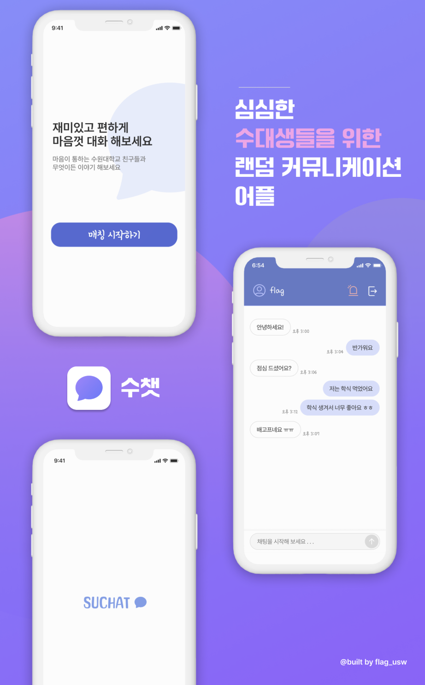

# 💬 수챗

  

## 1. 프로젝트 소개
Suchat은 수원대학교 학생들을 위한 랜덤 채팅 서비스입니다.  
회원 인증, 이메일 인증, 랜덤 매칭, 실시간 채팅 기능을 포함한 백엔드 시스템으로,  
Spring Boot와 JWT 기반 인증 구조를 적용해 안전한 채팅 환경을 목표로 개발했습니다.

---

## 2. 주요 기능
### 사용자(User)
- 회원가입 / 로그인 / 회원 정보 조회  
- 이메일 인증(회원가입 시 토큰 발급 및 검증)  
- 실시간 랜덤 매칭  
- 실시간 채팅

---

## 3. 기술 스택

### Backend
- Java 11 · Spring Boot · Spring Security + JWT  
- JPA · MySQL · Redis  
- Gradle

### Frontend
- Flutter (Mobile)

### Infrastructure
- AWS EC2

---

## 4. 시스템 설계

---

## 5. 담당 업무(Backend)
본 프로젝트에서 백엔드 기능, 보안, 데이터베이스, 인프라 전반을 담했습니다.  

### 인증·보안
- Spring Security + JWT 기반 인증·인가 구조 설계  
- Access / Refresh Token 설계 및 적용  
- 이메일 인증 토큰 발급 및 검증 로직 구현  
- 만료된 인증 토큰 삭제 스케줄러 작성  

### 회원 관리
- 회원가입 / 로그인 API 및 서비스 로직 개발  

### 매칭
- Redis Sorted Set(ZSET)을 활용한 랜덤 매칭 큐 구현  
- 2명 이상 대기 시 자동으로 매칭 → roomId 생성  

---

## 6. 트러블 슈팅

### 1. Redis ZSet 및 비동기 기반 논블로킹 매칭 엔진 설계
- **문제**: 분산 환경의 매칭 상태 공유가 필요했으나, 일반 Queue 사용 시 매칭 취소 요청 처리를 위한 탐색 및 삭제 복잡도가 높아 성능 병목이 예상됨. 또한 매칭 로직을 동기 방식으로 처리할 경우 사용자 유입 증가 시 서블릿 스레드 점유 시간이 길어져 시스템 전체 응답 지연 발생.
- **해결**: **Redis ZSet으로 매칭 대기열을 관리하여 취소 연산을 $\mathcal{O}(\log N)$으로 최적화하고, `@Async`를 활용해 매칭 로직을 별도 스레드 풀로 격리하여 클라이언트 응답 블로킹을 차단함.**
- **결과**: 큐 진입 직후 즉시 응답을 반환하여 사용자 체감 속도를 개선했으며, 분산 환경에서도 안정적인 실시간 매칭 시스템 구축. 동기 처리 대비 워커 스레드 효율을 높여 피크 타임 처리량(Throughput) 극대화.
### 2. Redis RTR 기반 하이브리드 토큰 보안 체계 구축
- **문제**: Stateless한 JWT 특성상 토큰 탈취 시 서버 측에서 해당 세션을 즉시 무효화할 수 없어 보안 리스크가 존재함.
- **해결**: **Access Token의 수명을 단축하고 Redis에 Refresh Token을 저장하여 재발급 시마다 토큰을 갱신하는 RTR(Rotation) 및 화이트리스트 검증을 도입함으로써 서버의 세션 통제권을 확보함.**
- **결과**: JWT의 확장성을 유지하면서도 탈취 토큰 실시간 차단 등 세션 방식 수준의 보안 인증망 구축. Redis 기반의 $\mathcal{O}(1)$ 검증 연산으로 인증 과정의 성능 저하 최소화.
